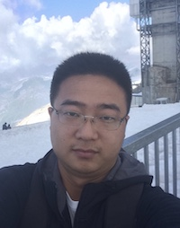

* [Research](https://sihaohuanguc.github.io/research)
* [Experiences](https://sihaohuanguc.github.io/experiences)
* [Publications](https://sihaohuanguc.github.io/publications)
* [Blog](https://sihaohuanguc.github.io/blog)

# About
<!--  -->

My name is Sihao Huang. I'm currently a PhD candidate at University of Chicago. My thesis mentor is Prof. [Tao Pan](https://bcmb.uchicago.edu/program/faculty/tao-pan). My research focus is **Bioinformatics**. I mainly work on developing computational methods to identify base modifications on genome and transcriptome through Next-Generation Sequencing (NGS) and Nanopore Sequencing. Machine learning is involved in the models. I also write open sourse python packages to make the approaches availble to general users. I participate in projects of many biological directions with bioinformatics methods and tools, like immunology, microbiome, COVID19, cell biology, etc. I enjoy collaborating with researchers with different academic backgrounds like chemistry, cell biology, immunology, microbiology and CS.
 
 
I got my B.S. degrees in Biology and Mathematics at Peking University in Beijing in 2018. I started my PhD program at University of Chicago in Sept 2018. 2022 would be my 5th year in Chicago. I will graduate in 2023 or 2024. After that, I plan to search for an industry job of Bioinformatics or Data Science in US.
 
 
I like cycling along the shore of Lake Michigan. I like building [LEGO](https://www.lego.com/en-us) models. I like cooking. I like traveling. I've visited 12/50 states in US and hope to visit more in the future.

# News
1. I'm going to do a poster presentation at 2022 UChicago Molecular Biosciences Retreat on Oct 14-15!
2. A new co-authored paper has been accepted on Monday, Sep 26! Congrats to the first author, Chris! Hope to see it online soon!

# Contact
Email: sihaohuang1024@gmail.com
 
LinkedIn: [Sihao Huang](https://www.linkedin.com/in/sihao-huang-1aa545160/)
 
Twitter: @SihaoHuang1024
 
Facebook: Sihao Huang

# External links
[Pan Lab website](https://openwetware.org/wiki/Pan_Lab)
 
[Program student page](https://bcmb.uchicago.edu/program/students?page=1)
 
[Meren (collaborator and committee member) Lab website](https://merenlab.org)
 

